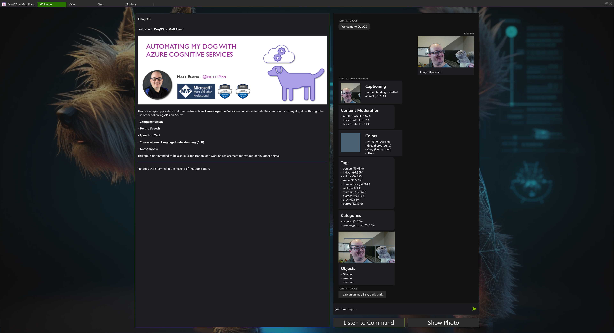
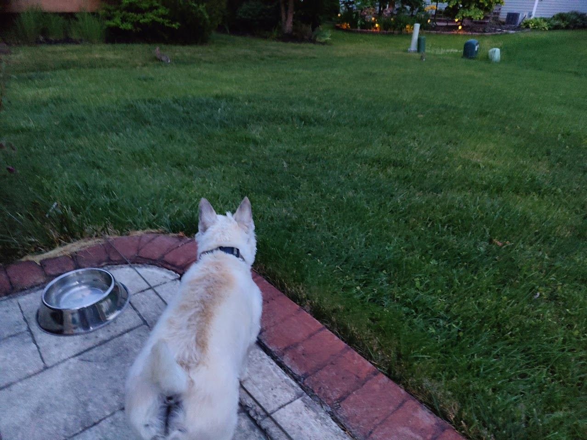
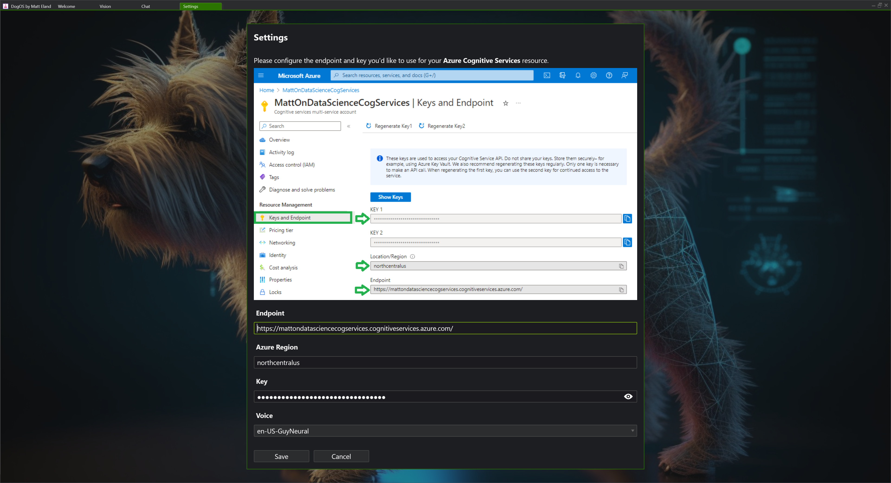
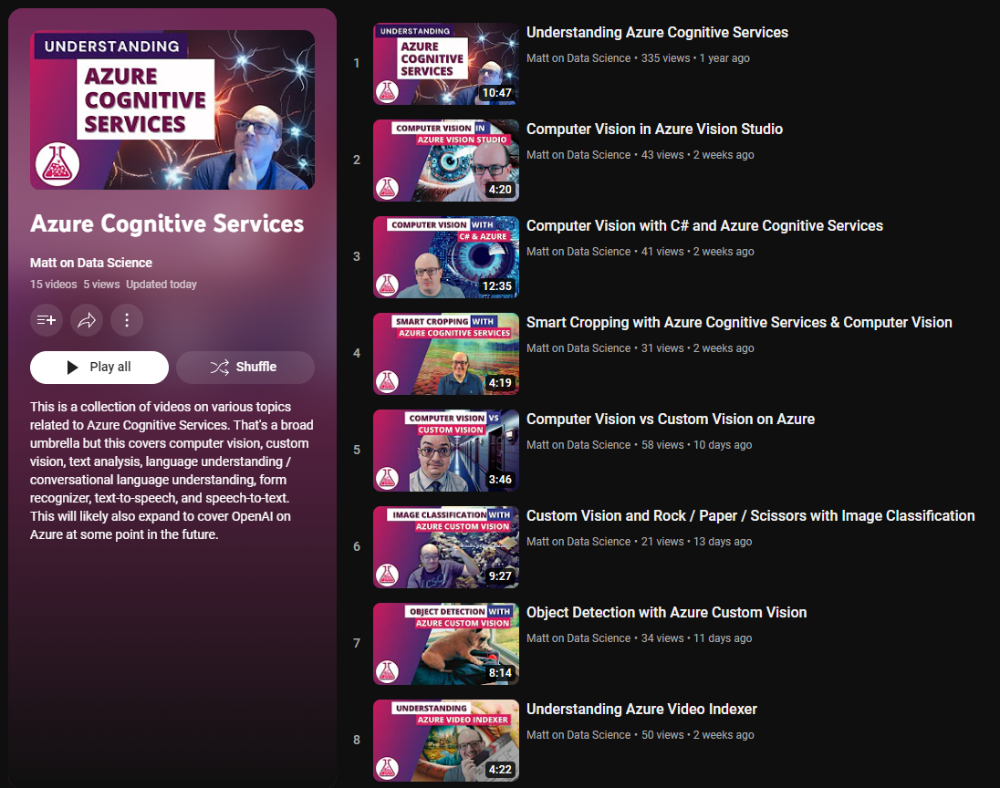

# AutomatingMyDog
Ridiculous reference materials demonstrating using Azure Cognitive Services to build intelligent applications using C# code

Code for this project can be found at [GitHub.com/IntegerMan/AutomatingMyDog](https://github.com/IntegerMan/AutomatingMyDog)

I've also written up details on this project in the past, though this was before upgrading the user interface significantly. Those details can be found [on my blog](https://accessibleai.dev/post/automating_my_dog/) or [on my YouTube channel](https://youtu.be/wmY4lNV0wZE)

## About this Project

This application is a tool developed by [Matt Eland](https://MattEland.dev) to teach people what's possible using Azure Cognitive Services.

Since Azure Cognitive Services can handle speech, listening, vision, and even aspects of reasoning, I figured that I could use it to mimic some of the things my dog does around the house so that he could live a happier and more productive life, knowing that the automated dog was ready to watch for rabbits so he didn't have to.

## Configuring the Project

In order to properly configure the application you will need:

- An Azure Cognitive Services resource running in Azure
- The endpoint, region, and one of the keys of this resource

Configure these settings on the **Settings** tab.

## Running the Application

Running this application will small incur charges against your Azure account for image recognition, text to speech, speech to text, text analysis, and language understanding based on your usage level.

This application currently only supports Windows operating system due to some libraries used in annotating images for object detection. Azure Cognitive Services does not depend on Windows.

In order to build this project, you will need to have a valid [Telerik UI for WPF](https://www.telerik.com/products/wpf/overview.aspx) license.

*Note: Kudos to Telerik for providing Microsoft MVPs with licenses to their products. This made the application significantly more impressive to demo and cut down my development time greatly, particularly for the chat and webcam components.*

## Learning Resources

Here are some articles I've written around Azure Cognitive Services:

- [Understanding Azure Cognitive Services](https://accessibleai.dev/post/cognitiveservices/)
- [How to Get Started with Azure Cognitive Services](https://accessibleai.dev/post/azure_cognitive_services/)
- [Text-to-speech with Azure Cognitive Services](https://accessibleai.dev/post/text-to-speech-cognitive-services/)
- [Speech-to-text with Azure Cognitive Services](https://accessibleai.dev/post/speech-to-text-cognitive-services/)
- [PII Identification with Azure Cognitive Services in C#](https://accessibleai.dev/post/pii-identification-w-cognitive-services/)
- [Computer Vision in C# using Azure Cogntivie Services](https://accessibleai.dev/post/computer-vision/)
- [Entity Recognition with Azure Cognitive Services in C#](https://accessibleai.dev/post/entity-recognition-cognitive-services/)
- [Key Phrase Extraction with Azure Cognitive Services in C#](https://accessibleai.dev/post/key-phrase-extraction-with-azure-cognitive-services/)
- [Sentiment Analysis with Azure Cognitive Services in C#](https://accessibleai.dev/post/sentiment-analysis-with-azure-cognitive-services/)
- [Detecting Languages with Azure Cognitive Services in C#](https://accessibleai.dev/post/detecting-language-with-azure-cognitive-services/)
- [Language Understanding in C# with LUIS](https://accessibleai.dev/post/languageunderstandingincsharp/)
- [Understanding Language Understanding (LUIS)](https://accessibleai.dev/post/luis/)
- [Managing your Azure Cognitive Services Costs](https://accessibleai.dev/post/azure_cog_services_pricing/)

I've also created a growing number of Videos on Azure Cognitive Services.

For best results, check out my [YouTube Playlist on Azure Cogntive Services](https://www.youtube.com/playlist?list=PL_4SjWezd5HyRTJ4xCvfVBGg0Qehbk27U) but I also recommend looking at my [Matt on Data Science channel](https://www.youtube.com/c/MattEland) for other related content.

## Development Tasks

I want to get the following tasks done for demos:

Global App:
- [x] Set the basic layout of the desktop app
- [x] Global Navigation
- [x] Global error handling in the desktop app
- [x] Add a place in the desktop app to enter your cognitive services keys / endpoints
- [x] Save Settings to a Settings File
- [x] Extract a control for the chat region

Text / Chat:
- [x] Add a "listen" button to the desktop app
- [x] Add a text chat feature to the desktop app
- [x] Add a log of things the app has said to you
- [x] Send message on to Text Analytics APIs to get sentiment analysis etc.
- [x] Send message on to LUIS to get app responses
- [x] Speak a message as a result of the intent

Images: 
- [x] Add a Telerik Webcam to the desktop app
- [x] Add a "take a picture" button to the desktop app
- [x] Save snapshot to snapshot.png
- [x] Include source image in image chat
- [x] Send image on to computer vision
- [x] Include image tags, etc. in chat results
- [x] Object bounding boxes in image chat
- [x] Smart thumbnail results in image chat

## Future Enhancements
For KCDC and beyond:

### Onboarding Improvements
- [x] Expand the `README.md` to include a description of the project and getting started configuration
- [x] Expand the `README.md` to include links to helpful content I've made
- [ ] Investigate Telerik use by non-license holders
- [ ] Add downloadable files in GitHub Releases

### Error Handling
- [x] Too Large File Handling
- [x] Non-Image or locked file error handling on Dragon Drop
- [x] Bad Key or Endpoint Handling
- [x] No Internet Connection Handling

### Global Improvements
- [x] Chat on the sidebar at all times
- [ ] UI Thread busy experience
- [x] Viewboxing for high resolutions
- [ ] Icons on Navigation and Buttons
- [ ] Include code examples in the app UI
- [x] Light Theme if System Supports it
- [ ] Upgrade to latest Telerik

### Hardware
- [x] Mount a webcam on the stuffed dog
- [x] Mount a speaker on the stuffed dog as a backup for HDMI audio-out issues
- [x] Bring a stuffed animal to show DogOS (Squirrel)

### Vision
- [x] Better card responses
- [x] Drop image onto chat from desktop to send the image
- [x] Respond with voice depending on what was detected in the image
- [x] Add an "upload picture" button to the chat region
- [x] Select specific camera

### Speech
- [x] Allow changing the voice of the dog to a set of presets

### Language Understanding & Content
- [ ] Add a greater amount of intents to the CLU model
- [ ] Move from LUIS to CLU
- [ ] Settings for LUIS / CLU
- [ ] Async / Await for Tasks
- [ ] Detect entities from LUIS / CLU
- [ ] Respond to Batman in image
- [ ] Include a few interesting images in the executing directory
